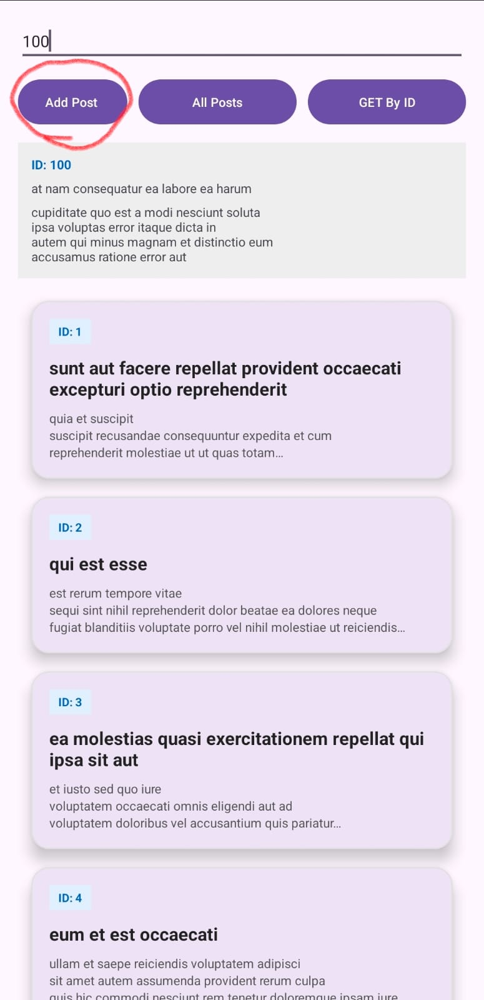
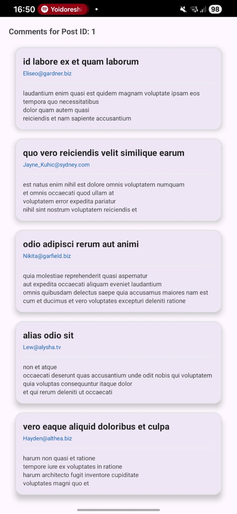

# 📱 ApiRetrofit - Android App

An Android application built using **Kotlin + Retrofit + MVVM Architecture**.

This project demonstrates how to interact with a REST API using:
- GET (All Posts)
- GET (Post by ID)
- POST (Create New Post)
- GET (Comments of a Post)

API Used:
https://jsonplaceholder.typicode.com/

---

## 🚀 Features

✅ Get all posts  
✅ Get post by ID  
✅ Click on a post to view its comments  
✅ Create a new post using POST method  
✅ MVVM Architecture  
✅ Retrofit + Gson  
✅ Coroutines  
✅ RecyclerView  

---

## 🏗️ Architecture

The project follows **MVVM architecture**:

## 📷 Screenshots

  
  

  
  

